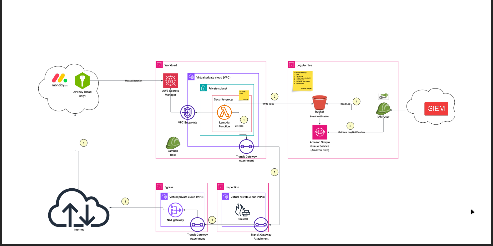

# monday-logs-to-siem

Terraform / Terragrunt module that provisions the AWS infrastructure for a Monday.com log-retrieval pipeline. A Lambda function running inside a private VPC fetches activity logs from the Monday.com API and writes them to a hardened S3 archive. An event-driven notification chain then delivers those logs to an SIEM instance for security monitoring.

---

## Architecture overview



### Data flow

| Step | Description |
|------|-------------|
| **①** | Lambda starts and retrieves the Monday.com API key from Secrets Manager via a **VPC Endpoint** (traffic never leaves the AWS network) |
| **②** | Lambda calls the Monday.com API. Outbound traffic routes through the **Transit Gateway → Inspection VPC (Firewall) → Egress VPC (NAT Gateway) → Internet** |
| **③** | Retrieved log objects are written to the hardened **S3 archive bucket** |
| **④** | S3 emits an **Event Notification** to SQS; SIEM polls the queue to detect new log arrivals |
| **⑤** |  SIEM reads log objects directly from S3 using a **dedicated IAM User** scoped to `s3:GetObject` on the archive bucket |

---

## Component reference

| Component | Purpose |
|---|---|
| **Lambda** | Python 3.11 function that calls the Monday.com API and writes log objects to S3 |
| **Secrets Manager** | Stores the Monday.com API key (Read-only). Key is rotated **manually**; injected at runtime via `SECRET_NAME` / `SECRET_ARN` env vars |
| **KMS (CMK)** | Envelope-encrypts the Secrets Manager secret; automatic annual key rotation enabled |
| **VPC Endpoints** | Allow Lambda to reach Secrets Manager and other AWS APIs without traversing the internet |
| **Security Group** | Egress-only on port 443; zero inbound rules |
| **Transit Gateway** | Hub connecting the Workload, Egress, and Inspection VPCs |
| **Inspection VPC** | Houses the network firewall; all internet-bound traffic is inspected before egress |
| **Egress VPC** | Single NAT Gateway providing a controlled, auditable internet exit point |
| **S3 Bucket** | WORM-protected log archive with versioning, SSE-KMS, access logging, CloudTrail, and Glacier tiering |
| **SQS** | Decouples S3 event notifications from SIEM ingestion; provides buffering and retry |
| **IAM User** | Read-only identity used by SIEM to pull log objects from S3 |
| ** SIEM** | On-premises SIEM that ingests the logs for security analytics and alerting |

> **Note:** The S3 bucket, SQS queue, and IAM user for SIEM are provisioned in a separate **Log Archive** Terragrunt layer and are shown here for context only.

---

## Security approach

- **Least-privilege IAM** — the Lambda execution role carries three narrowly scoped inline policies: `ReadSecret` (single Secrets Manager ARN), `DecryptSecret` (single KMS key ARN), and `ManageNetworkInterfaces` (required for VPC-attached Lambdas). No wildcards on any resource.
- **KMS encryption** — the Monday.com API key is envelope-encrypted with a dedicated Customer Managed Key. The key policy explicitly names the deploying identity and Lambda role as the only key users.
- **Secrets Manager** — credentials are never baked into environment variables or deployment artefacts. The Lambda resolves the secret at runtime using the injected `SECRET_ARN`.
- **Network isolation** — Lambda runs in private subnets with no direct internet route. All outbound traffic is funnelled through the Transit Gateway, inspected by the network firewall, and exits via a single NAT Gateway.
- **WORM archive** — S3 Object Lock immutability prevents log tampering post-write.
- **TLS 1.3** — enforced on all API calls via the Python `urllib3` / `requests` stack (runtime default in Python 3.11 on Lambda).
- **Public access blocked** — Secrets Manager resource policy has `block_public_policy = true`.

---

## Landing zone integration

This module lives inside a large enterprise AWS Landing Zone IaC monorepo structured with Terragrunt. Account-level configuration (VPC ID, region, environment name/type, and governance tags) flows down from `region.hcl` via `find_in_parent_folders()`, so the same module deploys cleanly across environments without duplication.

The three-VPC hub-and-spoke network topology (Workload · Inspection · Egress) is shared infrastructure managed centrally by the platform team; this module simply attaches to it via the existing Transit Gateway.

Internal Terraform modules are sourced from a private Azure DevOps Git repository. The placeholder sources in this portfolio copy (`git::https://github.com/your-org/terraform-modules//...`) map 1-to-1 with the real module paths.

---

## Stack

| Layer | Technology |
|---|---|
| Language | Python 3.11 |
| Compute | AWS Lambda |
| Encryption | AWS KMS (CMK, annual rotation) |
| Secrets | AWS Secrets Manager (manual rotation) |
| Networking | VPC · Private subnets · VPC Endpoints · Security Groups · Transit Gateway · NAT Gateway · Network Firewall |
| Log storage | Amazon S3 (WORM, SSE-KMS, Glacier) · Amazon SQS |
| IaC | Terraform >= 1.5 · Terragrunt >= 0.50 |
| SIEM |  SIEM (Hidden) |

---

## Prerequisites

- Terraform >= 1.5
- Terragrunt >= 0.50
- An existing VPC with private subnets tagged `environment-name`, `environment-type`, and `Name=*private-app*`
- A Transit Gateway already attached to the VPC (managed by the platform team)
- AWS credentials with permissions to create IAM roles, Lambda functions, KMS keys, and Secrets Manager secrets
- A `region.hcl` in a parent folder (see `region.hcl.example`)

---

## Usage

1. Copy `region.hcl.example` to the appropriate parent folder as `region.hcl` and fill in real values.
2. Place `_include.hcl` in your Terragrunt layer directory alongside the Terraform root module.
3. Run:

```bash
terragrunt init
terragrunt plan
terragrunt apply
```

4. After the first apply, store the Monday.com API key in the created Secrets Manager secret:

```bash
aws secretsmanager put-secret-value \
  --secret-id "shared-services/monday-logs-retrieval/secret" \
  --secret-string '{"api_key":"<YOUR_KEY>"}'
```

---

## Notes

- This module was extracted and sanitised from a production shared-services account inside a large enterprise landing zone. Internal module sources, account IDs, VPC IDs, and organisation-specific tags have been replaced with generic placeholders.
- The Lambda function source code is not included in this repository.
- The Monday.com API key is rotated manually; an operational runbook for rotation is maintained separately.
